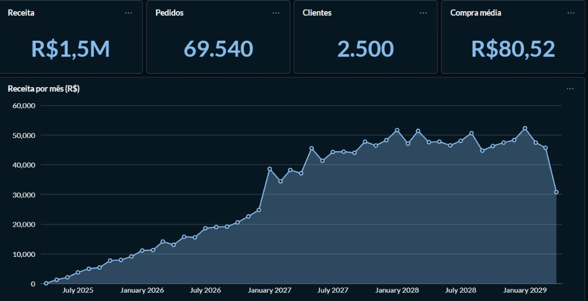
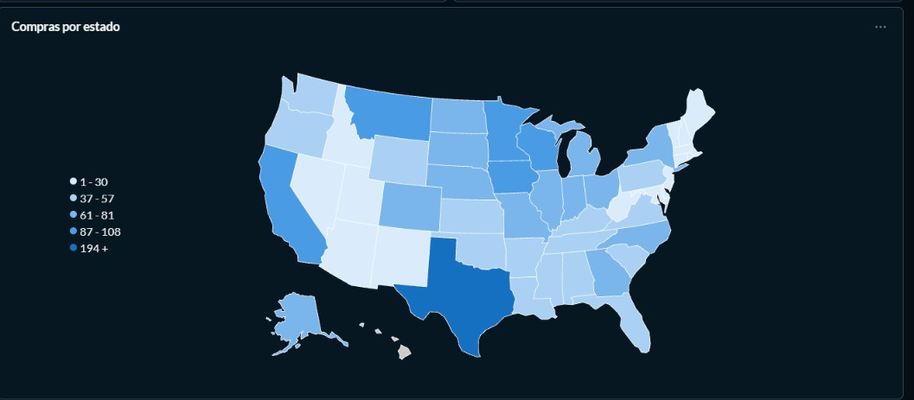
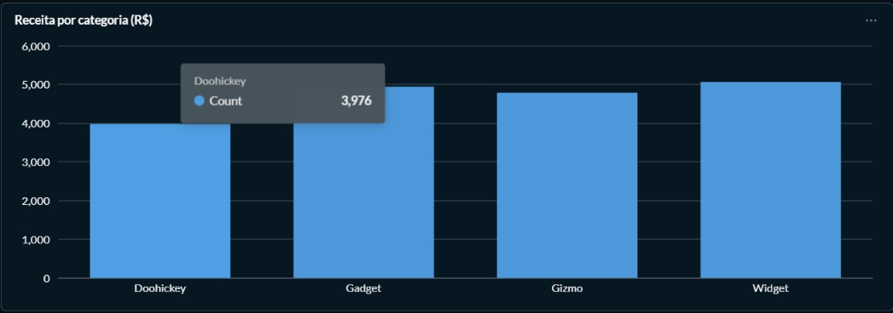
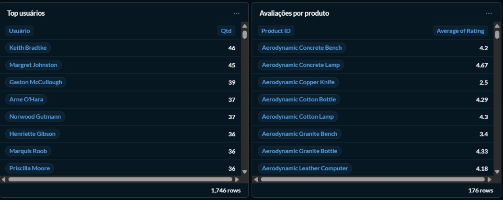
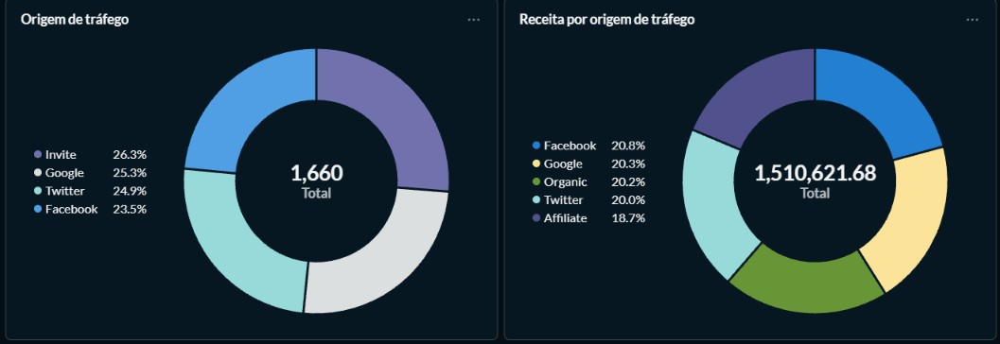

#  Dashboard de Vendas

Dashboard analítico com os principais indicadores de vendas, evolução da receita, distribuição geográfica, desempenho por categoria, clientes, avaliações de produtos e origem de tráfego.

---

## 1. Visão geral e receita ao longo do tempo

### Indicadores principais (KPIs)

| Métrica          | Valor    | Descrição                          |
|------------------|----------|------------------------------------|
| **Receita**      | R$ 1,5M  | Receita total acumulada            |
| **Pedidos**      | 69.540   | Total de pedidos realizados        |
| **Clientes**     | 2.500    | Quantidade de clientes             |
| **Compra média** | R$ 80,52 | Valor médio por pedido (ticket médio) |

### Receita por mês

- **Crescimento gradual (2025 – início de 2027):** receita chega a cerca de R$ 25 mil/mês.
- **Salto (início de 2027):** aumento abrupto, ultrapassando R$ 38 mil em um único mês.
- **Estabilização (2027 – 2029):** receita oscila entre ~R$ 45 mil e ~R$ 52 mil por mês.
- **Queda no último mês:** cerca de R$ 31 mil, por ser um mês com dados parciais.

---

## 2. Compras por estado

Mapa de calor dos EUA com a quantidade de compras por estado, dividido em faixas (1–30, 37–57, 61–81, 87–108 e 194+).

- **Texas** é o único estado na faixa mais alta (194+), destacando-se como principal mercado.
- **Califórnia, Montana, Minnesota, Iowa e Wisconsin** aparecem entre as faixas intermediárias-altas.
- Estados do nordeste e do sudoeste (ex.: Arizona, Novo México, Nevada) concentram os menores volumes.

---

## 3. Receita por categoria

Comparação entre as quatro categorias de produtos: **Doohickey, Gadget, Gizmo e Widget**.

- **Widget** lidera, seguida de perto por **Gadget** e **Gizmo**.
- **Doohickey** é a categoria com menor valor (3.976).
- A distribuição é relativamente equilibrada entre as categorias.

---

## 4. Top usuários e avaliações de produtos

**Top usuários:** ranking dos clientes com mais compras (1.746 registros no total). No topo estão Keith Bradtke (46), Margret Johnston (45) e Gaston McCullough (39).

**Avaliações por produto:** nota média de cada um dos 176 produtos, útil para identificar itens bem avaliados (ex.: Aerodynamic Concrete Lamp, 4,67) e produtos que precisam de atenção (ex.: Aerodynamic Copper Knife, 2,5).

---

## 5. Origem de tráfego

- **Origem de tráfego:** distribuição de 1.660 registros entre Invite (26,3%), Google (25,3%), Twitter (24,9%) e Facebook (23,5%).
- **Receita por origem de tráfego:** total de R$ 1.510.621,68, distribuído de forma bem equilibrada entre Facebook (20,8%), Google (20,3%), Organic (20,2%), Twitter (20,0%) e Affiliate (18,7%).

---

## 🛠️ Ferramentas

Dashboard construído com **[Metabase]** a partir de **[Sample Database]**.
!

